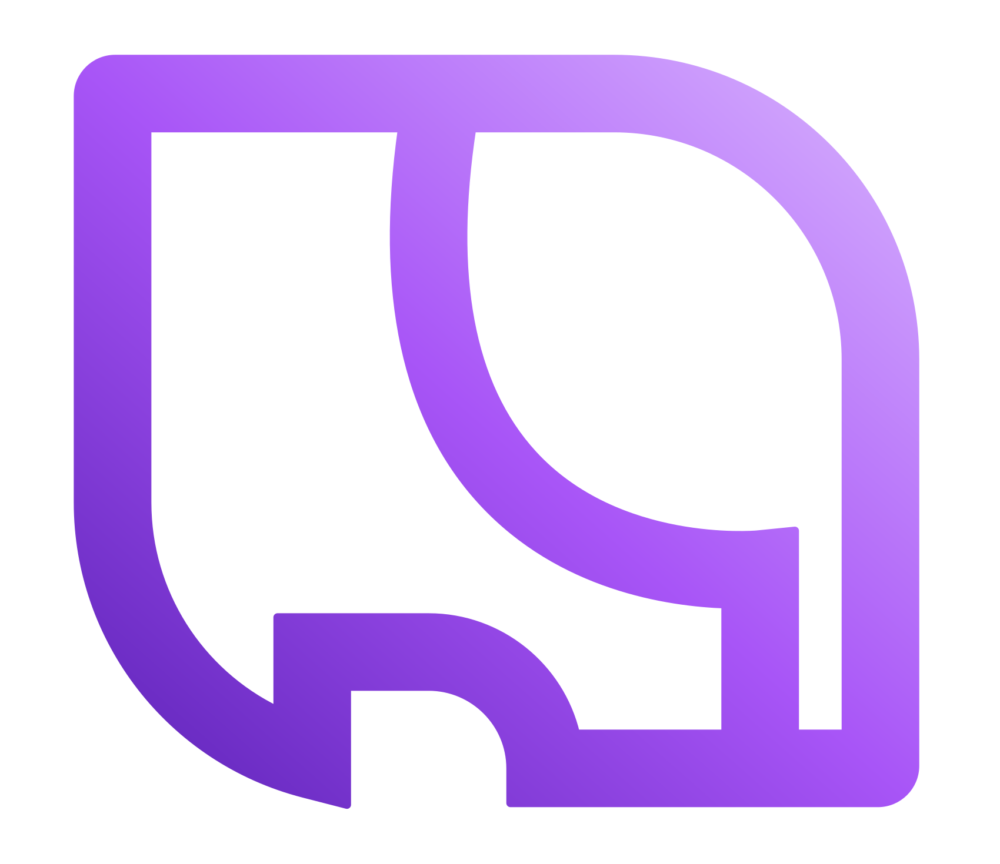

<p align="center">
  
</p>

# Shellephant

Containerized development environment manager with Claude Code, terminal, and file editor — one window per project.

Run Claude Code with `--dangerously-skip-permissions` safely: each project lives in its own Docker container, so Claude can operate fully autonomously without touching your host system. Spin up multiple windows to drive several codebases in parallel.

---

## Prerequisites

- [Docker](https://docs.docker.com/get-docker/) (running)
- [Node.js 20+](https://nodejs.org/)
- Anthropic account (OAuth login via Claude Code)

---

## Quick Setup

```bash
# 1. Clone and install
git clone <repo-url>
cd claude-window/window-manager
npm install

# 2. Run
npm run dev
```

On first launch, create a project with a Git SSH URL to get started.

---

## Features

### Windows & Projects

Each project is a Docker container cloned from a Git repo. Claude Code runs inside it with `--dangerously-skip-permissions`, so it can read, write, and execute freely without permission prompts — contained to that repo, never touching the host. Run as many windows as you have work in flight.

- Each project maps to a Git repo (SSH URL), port bindings, and environment variables
- Create isolated Docker containers per project with one click
- Two-click delete pattern prevents accidental removal

---

### Panel Layout

Three panels side-by-side in one window: watch Claude work in the left panel, run commands in the terminal, and inspect or edit files in the editor — all inside the same container. Useful for supervising an autonomous Claude session without context-switching.

- Three panels: **Claude** (AI coding assistant), **Terminal** (shell in container), **Editor** (Monaco)
- Toggle any panel on/off; drag headers to reorder; drag resize handles to adjust widths
- Layout persists across sessions

---

### Git Workflow

When Claude finishes a task, commit and push without leaving the app. The footer shows the live branch and dirty-file count so you know at a glance what state each container is in across all your parallel efforts.

- Live branch name and dirty-file status in the footer
- Stage and commit with subject + body from the commit modal
- Push and get a PR URL back automatically

---

### In-Container File Editor

Browse and edit files inside the container directly — no volume mounts or host-side checkout needed. Useful for spot-checking Claude's changes or making a quick fix while a session is running.

- Monaco editor with syntax highlighting for files inside the container
- File tree browser with lazy-loaded directory expansion
- `Ctrl+S` saves; editor polls every 2s for external changes without losing cursor position

---

### Service Dependencies

Attach databases or other services so Claude can run the full stack — migrations, integration tests, seed scripts — autonomously inside the container without any host-side setup.

- Attach companion containers (e.g. `postgres:16`, `redis:latest`) to any project
- Dependency containers join an auto-created bridge network with the main container
- Two-click delete to remove a dependency

---

### Project Groups

Organize projects when you're running many parallel efforts — group by client, team, or milestone to keep the sidebar manageable.

- Assign projects to named groups via the group strip
- Create a new group inline — type a name, press Enter
- Switch groups with one click to filter the project list

---

## Build for Distribution

```bash
npm run build:win    # Windows
npm run build:mac    # macOS
npm run build:linux  # Linux
```


---

## Configuration

Per-project environment variables can be set in the project settings. Claude Code authenticates via OAuth — no API key needed.
